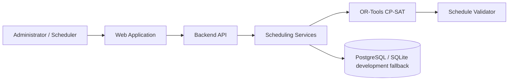

# ReSlot

<p align="center">
  
</p>

### Minimum-Disruption Timetable Recovery

> ReSlot generates conflict-free academic timetables and repairs real-world disruptions while changing as little of the published timetable as possible.

**Web-A-Thon 2.0 — Nexus Spring Of Code**
**Round:** Ideation & Initial Submission
**Problem Statement:** AI-Based Timetable Generation System

## Round 1 Submission

The complete technical proposal is available here:

➡️ [View Round 1 Submission](./docs/ROUND1_SUBMISSION.md)

## The Problem

Academic timetables must coordinate teachers, student cohorts, classrooms, laboratories, availability and institutional rules. A timetable that is valid when published can become invalid after one teacher absence, room closure or blocked timeslot, creating cascading conflicts for other classes.

## Our Solution

ReSlot handles both initial timetable generation and recovery of a published timetable.

```text
Generate → Publish → Disruption → Minimum-Change Repair → Review → Approve
```

The published schedule becomes a baseline. ReSlot searches for a valid repair while preserving unaffected assignments wherever possible.

## Core Innovation

### Minimum-Disruption Timetable Recovery

The optimization priority is:

```text
Constraint Validity > Schedule Stability > Soft Preferences
```

Scheduling decisions use deterministic constraint optimization rather than a generative model inventing a timetable.

## Architecture



## Technology Stack

| Layer | Technology |
|---|---|
| Frontend | Next.js, React, strict TypeScript, Tailwind CSS |
| Backend | Python, FastAPI, Pydantic, SQLAlchemy, Alembic |
| Optimization | Google OR-Tools CP-SAT |
| Database | PostgreSQL with SQLite development fallback |
| Authentication | Supabase JWT integration with local demo mode |
| Testing | pytest, Vitest, Testing Library |
| Deployment strategy | Separate web/API services with managed PostgreSQL support |

## Key Capabilities

- conflict-free timetable generation
- teacher, room, cohort, availability, capacity and room-type constraints
- minimum-change repair after teacher, room or timeslot disruption
- before/after schedule comparison and stability measurement
- independent schedule validation and solver-status reporting
- human review before a repaired schedule is published

## Round 1 Scope

This repository intentionally presents the Round 1 ideation and technical proposal. It covers problem understanding, architecture, backend and database design, APIs, optimization, automation, scalability, deployment, security and external technology disclosure.

➡️ [Read the Round 1 Technical Submission](./docs/ROUND1_SUBMISSION.md)

## Author

**Akash Agarwal**
[GitHub: @kauntiaakash2](https://github.com/kauntiaakash2)

## Hackathon

**Web-A-Thone 2.0**
Nexus Spring Of Code
