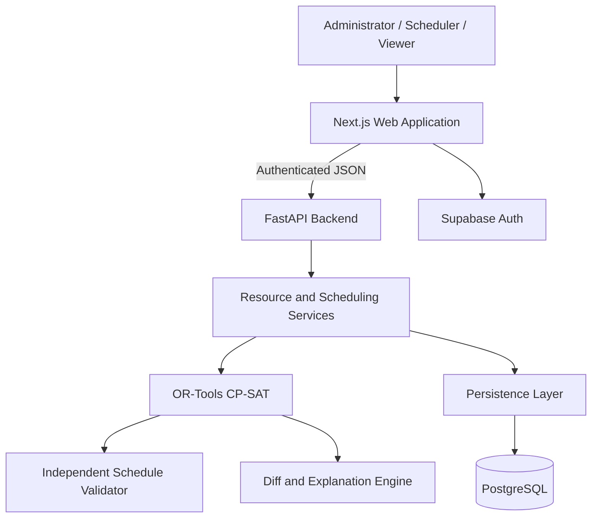
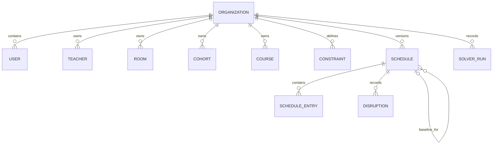

# ReSlot — Minimum-Disruption Timetable Recovery

> Generate conflict-free academic timetables and repair real-world disruptions while changing as little of the published schedule as possible.

**Problem Statement:** AI-Based Timetable Generation System

## 1. Problem Understanding

Academic timetabling coordinates teachers, student cohorts, rooms and laboratories across a limited teaching week. A teacher cannot teach two classes at once, a cohort cannot attend overlapping sessions and a room cannot host multiple classes simultaneously. Availability, room capacity, specialist laboratory requirements, session counts and multi-period classes add further constraints.

Creating the first valid timetable is already a difficult constraint problem. The operational challenge continues after publication: a teacher may become unavailable, a classroom or laboratory may close, or an institution may block a timeslot. A schedule that was valid yesterday can become invalid today, and moving one class can trigger a cascade of room, teacher and cohort conflicts.

> A timetable may be valid when published but become invalid after a single real-world disruption.

Manual repair is slow and often changes more classes than necessary. Replacing the whole timetable protects validity but disrupts faculty and students who were unaffected by the incident. ReSlot addresses both the initial generation problem and the stability problem that follows publication.

## 2. Proposed Solution

ReSlot gives administrators and schedulers a reviewable workflow:

```text
Institution Data → Scheduling Constraints → Initial Timetable Generation
→ Candidate Review → Published Baseline
→ Real-World Disruption → Minimum-Change Repair
→ Before/After Comparison → Human Approval → Republished Timetable
```

The system generates a candidate from institutional resources and constraints. Once published, that timetable becomes the baseline for future recovery. When a disruption is reported, ReSlot updates the affected constraints and searches for a new feasible assignment while preserving unaffected entries wherever possible. The candidate shows moved classes, stability metrics and explanations before an administrator approves publication.

This makes timetable recovery a controlled decision rather than an unrestricted regeneration. Directly affected classes are distinguished from secondary changes required to restore feasibility.

## 3. Core Innovation

ReSlot is more than a timetable CRUD application, dashboard or generative-AI wrapper. Its central innovation is **Minimum-Disruption Timetable Recovery**: the published schedule is an optimization baseline, and repair is evaluated by both validity and the amount of change introduced.

```text
Constraint Validity
        >
Schedule Stability
        >
Soft Preferences
```

Hard constraints are mandatory. Among valid schedules, the repair objective follows **changed-session count > movement severity > soft preference**. An unchanged assignment has zero repair cost. The implemented movement costs are **room change = 1**, **time/start change = 4** and **day change = 10**; preference penalties are considered only after these priorities.

The result is a schedule that is valid, explainable and stable. Solver statuses remain truthful: `OPTIMAL` proves that the minimum-change objective has been optimized under the modeled constraints, while `FEASIBLE` means a valid incumbent was found without an optimality proof.

## 4. System Architecture



- **Web application:** setup, resource catalogs, constraint editing, timetable views, disruption reporting, comparison and approval.
- **Backend:** request validation, authentication, role checks, state transitions, imports and persistence.
- **Optimization engine:** generates and repairs schedules from domain inputs without depending on HTTP or database code.
- **Validator and diff engine:** independently checks hard constraints, compares baseline and candidate assignments and produces human-readable explanations.
- **Database:** stores organization resources, immutable schedule versions, disruptions and solver provenance.

The architecture uses one frontend, one backend service and one relational database. This keeps the hackathon system understandable while leaving a clear boundary for asynchronous solver workers as usage grows.

## 5. Technology Stack

| Layer | Technology | Purpose |
|---|---|---|
| Frontend | Next.js, React, TypeScript | Interactive scheduling interface |
| UI | Tailwind CSS, Lucide | Responsive layout and visual language |
| Backend | FastAPI, Pydantic | APIs, validation and business services |
| Optimization | Google OR-Tools CP-SAT | Constraint scheduling and minimum-change repair |
| Database | PostgreSQL | Institutional data and schedule history |
| Authentication | Supabase Auth | Identity and role-based access |
| Deployment | Vercel, container hosting and managed PostgreSQL | Separated web, API and database deployment |
| Delivery | Docker, Alembic and GitHub Actions | Packaging, migrations and CI checks |

## 6. Backend Approach

FastAPI routes validate requests with Pydantic and pass domain operations to resource, scheduling and repair services. Resource services validate teachers, rooms, courses, cohorts, constraints and CSV imports before persistence. Scheduling services manage candidate, published and archived states.

Generation expands course requirements into class sessions and invokes CP-SAT. Repair validates an immutable published-baseline snapshot, applies the disruption to that snapshot and solves with baseline-aware penalties. An independent validator checks every candidate before it is stored or published. Candidate, published and archived state transitions are protected by revision checks so stale candidates or concurrent resource edits cannot silently replace newer data.

Responses include solver status, schedule metrics, assignments and, for repairs, a structured diff. Infeasible and unfinished solves return their actual status and do not replace the current published schedule. Errors are returned as safe, typed API responses rather than raw server traces.

## 7. Database Design

The relational model is organized around an institution and its schedule versions.

| Entity | Responsibility |
|---|---|
| Organization | Institution boundary and current schedule pointer |
| User | Identity, organization membership and role |
| Teacher, Room, Cohort, Course | Scheduling resources and requirements |
| Constraint | Teaching-week availability and policy configuration |
| Schedule | Candidate, published or archived version with baseline reference |
| Schedule Entry | Session assignment to a start period and room |
| Disruption | Reported unavailability linked to baseline and candidate |
| Solver Run | Status, objective, duration and validation metrics |



Each schedule stores the input snapshot used for optimization, so later catalog edits do not rewrite historical timetables and every version remains reproducible. Repaired schedules reference their published baseline; publishing a repaired candidate archives the previous version and advances the organization’s current schedule pointer. Disruption and solver-run history provide traceability from an incident to the candidate and its outcome. Organization-scoped queries and membership checks provide tenant isolation; relational keys and unique schedule-entry constraints protect data integrity.

## 8. API Design

The API is versioned under `/api/v1` and exposes the workflow directly:

| Method | Endpoint | Purpose |
|---|---|---|
| POST | `/schedules/generate` | Generate a candidate timetable |
| POST | `/schedules/{id}/repair` | Repair the published baseline after a disruption |
| GET | `/schedules/{id}` | Retrieve a schedule and its entries |
| GET | `/schedules/{id}/diff/{other}` | Compare two schedule versions |
| POST | `/schedules/{id}/publish` | Approve and publish a candidate |
| GET | `/teachers`, `/rooms`, `/courses`, `/cohorts` | Read scheduling resources |
| POST | `/teachers`, `/rooms`, `/courses`, `/cohorts` | Create or update resources |
| GET/POST | `/constraints` | Read or update teaching-week constraints |
| POST | `/import` | Preview and validate CSV resource imports |

A repair request identifies the disruption and affected resource or slots:

```json
{"kind":"teacher","resource_id":"t1","slots":[8,9,10],"note":"Faculty unavailable"}
```

The response contains an unpublished candidate, solver status, stability metrics, changed entries and explanations. Publication remains a separate, authorized action.

## 9. AI / Optimization Implementation

### Decision Problem

ReSlot uses Google OR-Tools CP-SAT for deterministic combinatorial optimization. Each required session receives a start period and a compatible room. Fixed-duration intervals model occupied periods, while allowed assignment pairs remove rooms that fail capacity or laboratory requirements.

### Hard Constraints

The model enforces:

- no teacher overlap;
- no cohort overlap;
- no room overlap;
- teacher and room availability;
- institution-wide blocked periods;
- room capacity and classroom/laboratory compatibility;
- every required session assigned exactly once; and
- duration within the teaching day.

### Soft Constraints

The current preference objective favors earlier starts within a day. Faculty gaps, workload balance and subject spacing are intentionally separate future objectives.

### Minimum-Change Repair

The published timetable supplies the repair baseline. Reified change variables compare each candidate assignment with its baseline assignment. The objective is:

```text
Change Count Penalty
+ Change Severity Penalty
+ Preference Penalty
```

The weights are ordered so that one fewer changed session outweighs all severity and preference improvements, and one severity unit outweighs preference improvements. This preserves the priority of validity, then stability, then convenience without relaxing hard constraints.

### Reliability

The solver output is independently validated before persistence and publication. `OPTIMAL`, `FEASIBLE`, `INFEASIBLE`, `UNKNOWN` and `MODEL_INVALID` remain distinct: only `OPTIMAL` proves that the minimum-change objective has been optimized under the modeled constraints; `FEASIBLE` is valid but not proven optimal. Explanations are derived from known resource and interval conflicts; secondary changes are labeled as cascade adjustments. Human approval is required before a repaired timetable becomes the new published baseline.

The model understands the weekly constraints represented in the domain. Substitute-teacher search, emergency insertion and richer institutional policies are future extensions. Larger workloads may require longer solve budgets or worker processes.

## 10. Automation Opportunities

### Optimization

CP-SAT evaluates competing teacher, cohort, room and availability requirements and finds a globally feasible assignment with the lowest modeled repair cost.

### Automation

```text
Disruption reported
        ↓
Affected constraints updated
        ↓
Repair optimization executed
        ↓
Candidate independently validated
        ↓
Baseline and candidate compared
        ↓
Administrator reviews and approves
```

The same workflow validates CSV imports, records solver outcomes and preserves schedule history. Future integrations can ingest absence or maintenance events, enqueue repairs and notify affected users without changing the optimization model.

## 11. Scalability Approach

### Hackathon MVP

Next.js, FastAPI, PostgreSQL and synchronous bounded solver execution provide a simple deployment and a clear request lifecycle. The API is stateless apart from database state, and immutable snapshots make each solve reproducible.

### Early Adoption

Add connection pooling, per-organization quotas, rate limiting and asynchronous jobs for solves that exceed interactive latency. A job should carry an immutable input snapshot and baseline revision so publication remains safe if data changes while it runs.

### Large Scale

Scale API instances horizontally and run dedicated solver workers behind a durable queue. Add cancellation, idempotent job records, shared rate limits and measured database indexing/capacity improvements. The publication revision check remains the final guard against stale results.

## 12. Deployment / DevOps Approach

The web application can run on Vercel or another Node-compatible host. The FastAPI service is packaged for container hosting such as Render or Railway. PostgreSQL can run as a managed Supabase database or another hosted PostgreSQL service.

Docker packages the backend, Alembic manages schema migrations and GitHub Actions runs frontend and backend quality checks. Environment variables hold database, authentication, CORS and solver settings; secrets remain outside the repository. The frontend and API deploy independently so either layer can scale without changing the solver domain.

## 13. Security & Reliability

The design includes:

- authenticated access with administrator, scheduler and viewer roles;
- organization-scoped reads and writes;
- server-side validation for API payloads and imports;
- parameterized database access and safe error responses;
- environment-based secret management and explicit CORS origins;
- bounded uploads and solver inputs;
- immutable schedule snapshots and stale-version protection; and
- independent hard-constraint validation before publication.

The system does not require individual student personal data. Rate limiting, durable background jobs, backup drills and expanded operational monitoring are production hardening priorities as adoption grows.

## 14. External Technologies & Disclosures

| Technology / Service | Usage |
|---|---|
| Next.js, React, TypeScript | Web application |
| Tailwind CSS, Lucide | Interface styling and icons |
| FastAPI, Pydantic | Backend APIs and validation |
| Google OR-Tools | CP-SAT timetable generation and repair |
| PostgreSQL, SQLAlchemy, Alembic | Persistence and migrations |
| Supabase Auth | Authentication integration |
| Docker, GitHub Actions | Packaging and continuous integration |
| Vercel, Render/Railway, Supabase | Deployment targets |

AI-assisted development tools, including OpenAI Codex, were used during implementation and documentation. Runtime scheduling decisions are performed by the deterministic CP-SAT optimization engine, not by a generative AI model. The demo institution uses synthetic resource data.

## 15. MVP Scope

### Implemented MVP

- Resource catalogs, weekly constraints and CSV validation/import.
- CP-SAT initial timetable generation with independent validation.
- Published baseline, immutable versions and schedule history.
- Teacher, classroom/laboratory and blocked-period disruption repair.
- Minimum-change objective, stability metrics and before/after diff.
- Direct and cascade explanations for changed entries.
- Explicit administrator approval before publication.
- Responsive timetable views with cohort, faculty and room filters.
- PostgreSQL persistence, local development fallback and role-based access.

### Future Scope

- Background solver workers and durable job queues.
- Richer workload, holiday, exam and multi-campus constraints.
- Substitute-teacher search and emergency-session insertion.
- ERP, calendar and notification integrations.
- Production rate limiting, monitoring and disaster-recovery operations.

## 16. Future Scope

The next product stage expands institutional integrations and constraint coverage while preserving the same baseline-aware repair objective. Approved changes can flow into calendars and notifications, and larger organizations can use dedicated solver workers without changing the user-facing recovery workflow.

## 17. Round 1 Summary

ReSlot addresses the full timetable lifecycle: generate a valid academic schedule, publish it, recover from disruption and approve a stable replacement. Its central innovation is minimum-disruption recovery, which treats the published timetable as a baseline and minimizes the number and severity of changes required to restore feasibility.

The Next.js, FastAPI, PostgreSQL and OR-Tools architecture separates interface, workflow, persistence and optimization. Deterministic hard constraints, independent validation, truthful solver statuses and human approval make the approach explainable and technically defensible. The same foundation can progress toward asynchronous solving, institutional integrations and larger deployments in later rounds.
