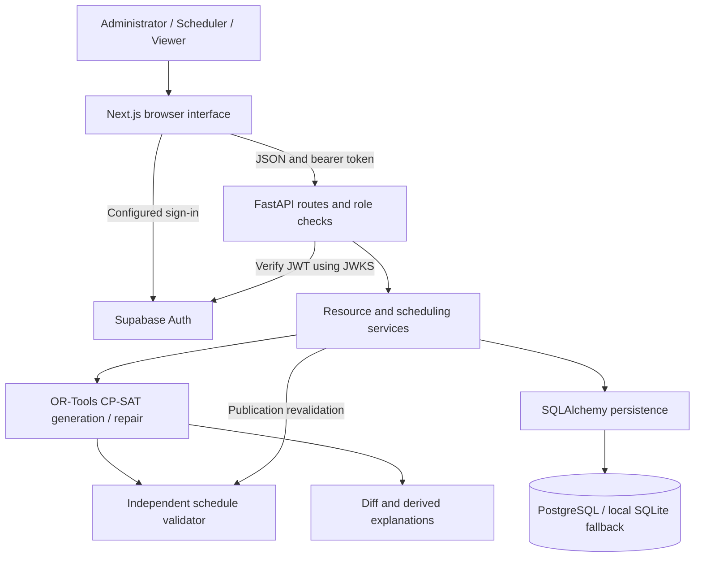
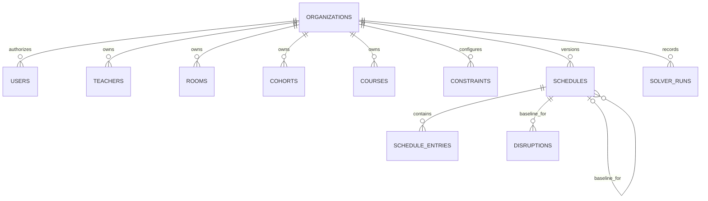

# ReSlot — Round 1 Submission

**ReSlot — Minimum-Disruption Timetable Recovery**

**Event:** Web-A-Thone 2.0 — Nexus Spring Of Code

**Participation:** Individual Participation

**Round:** Round 1 — Ideation & Initial Submission · **Weight: 30%**

**Problem Statement #14:** AI-Based Timetable Generation System

**Core idea:** Generate a valid academic timetable, then recover from real-world disruptions while changing as few published classes as possible.

**Repository scope:** This Round 1 upload contains only `README.md` and this document. The implementation, tests, screenshots and detailed supporting documents remain local; source paths below identify inspected local components, not files included in this GitHub submission.

**Submission status:** This design reflects an existing local MVP inspected against its source code. Implemented capabilities and future work are distinguished below. No hosted deployment or live Supabase authentication verification is claimed. This Round 1 preparation does not add application features.

## 1. Problem Understanding

Academic timetabling must coordinate teachers, student cohorts and rooms across a limited teaching week. A teacher cannot teach overlapping classes; a cohort cannot attend overlapping sessions; a room cannot host multiple classes simultaneously. Availability, room capacity, specialist laboratory requirements, session counts and multi-period durations further restrict assignments.

Finding the first valid timetable requires satisfying all these conditions together. Changing a published timetable adds another objective: preserving arrangements that faculty and students already rely on. Moving one class can consume another class's only feasible room or period, causing cascading changes.

> A timetable may be valid when published but can become invalid after a single real-world disruption.

Teacher absence, a closed classroom or laboratory, or an institution-wide blocked period therefore calls for a valid **and stable** recovery, rather than unrestricted regeneration. No administrative time-saving or adoption statistics are assumed.

## 2. Proposed Solution

ReSlot gives administrators and schedulers a reviewable recovery workflow:

```text
Institution Data → Scheduling Constraints → Initial Timetable Generation
→ Candidate Review and Publication → Published Baseline
→ Real-World Disruption → Minimum-Change Repair
→ Before/After Comparison → Human Approval → Republished Timetable
```

The user supplies resources and constraints, generates a candidate, and explicitly publishes it. After reporting a disruption, the system uses that published version as its baseline. It attempts to preserve unaffected entries, while allowing secondary changes when needed to restore feasibility. A candidate never replaces the published timetable automatically.

The differentiator is **Minimum-Disruption Timetable Recovery**: the interface shows what moved, what remained unchanged, and whether each move directly intersects the reported disruption or is a secondary adjustment.

## 3. Core Innovation

Resource management and the dashboard support the workflow; the technical contribution is a constraint optimization model with a baseline-aware objective. The application does not delegate timetable decisions to an LLM or generate an unrelated replacement schedule without accounting for disruption.

```text
Constraint Validity > Schedule Stability > Soft Preferences
```

More precisely, hard constraints are mandatory. Among valid solutions, repair minimizes **the number of changed baseline sessions**, then **change severity**, then **earlier-period preference penalties**. Calculated dominance weights enforce this ordering. Only an `OPTIMAL` repair proves minimum change under the modeled constraints; a `FEASIBLE` result is a valid incumbent without an optimality proof.

## 4. System Architecture



- **Web:** setup, catalogs, constraints, filtered weekly grid, disruption form, comparison, explanation dialog and history.
- **API/services:** authenticated access, validation, state transitions, imports and transactional publication.
- **Solver:** pure domain inputs and optimization; no HTTP or database dependency.
- **Validator/diff:** independently check assignments and describe actual differences.
- **Persistence:** organization-scoped resources, immutable version snapshots, entries and solve provenance.

The architecture uses one frontend and one backend service. No message broker, microservices or generative-model API is required.

## 5. Technology Stack

| Layer | Technology | Purpose |
|---|---|---|
| Frontend | Next.js App Router, React, TypeScript | Typed interactive scheduling workspace |
| UI | Tailwind CSS, custom CSS, Lucide, native HTML controls/dialog | Dense responsive timetable and accessible interactions; no shadcn dependency |
| Backend | Python, FastAPI, Pydantic, Uvicorn | Validation, authenticated HTTP endpoints and application services |
| Optimization | Google OR-Tools CP-SAT | Constraint satisfaction and baseline stability optimization |
| Database | PostgreSQL, SQLAlchemy, Alembic; SQLite local/test fallback | Durable transactions, JSONB snapshots and migrations |
| Authentication | Supabase JS client; PyJWT/cryptography and Supabase JWKS | Configurable sign-in and verified tokens; explicit local demo identity |
| Deployment | Backend Dockerfile, PostgreSQL Docker Compose, Next.js production build | Implemented packaging; Vercel/Render/Railway/Supabase hosting is documented, not deployed |
| Testing | pytest, Vitest, Testing Library, jsdom; Ruff/ESLint/TypeScript | Solver/API/auth regressions, frontend behavior and static checks |

## 6. Backend Approach

FastAPI routes receive requests and resolve identity and permissions. Pydantic rejects invalid fields, resource references and out-of-range slots. The resource/import services validate institution data before saving it; scheduling services enforce candidate, published and archived state transitions.

Generation expands course requirements into sessions and invokes CP-SAT. Repair validates the baseline, applies the disruption to a copied snapshot and solves with stability penalties. A separate validator checks any incumbent before candidate persistence. Publication checks persisted entries again and uses revision/current-version comparisons to reject stale candidates. Resource writes also reject stale concurrent edits.

Responses contain actual solver status, metrics, assignments and, for repair, a diff. Infeasible or unfinished searches record a solver run without creating a schedule. HTTP errors distinguish authentication, authorization, input, missing resources, stale state and database failure; unexpected errors use a generic response.

Keeping solver logic under `apps/api/app/solver/` separate from `api/` and `services/` makes hard constraints independently testable and allows a future worker process without redesigning the model.

## 7. Database Design

Actual tables in `apps/api/app/models/entities.py`:

| Entity/table | Stored responsibility |
|---|---|
| `organizations` | Institution, current schedule pointer, revision |
| `users` | Supabase subject, organization membership, server-side role |
| `teachers`, `rooms`, `cohorts`, `courses` | Organization/resource composite keys, validated JSONB payloads, update timestamps |
| `constraints` | Organization's `week` configuration |
| `schedules` | State, baseline reference, expected current version, data revision, full input snapshot and result |
| `schedule_entries` | Session ID, start, room, owning schedule |
| `disruptions` | Baseline/candidate references, submitted disruption and timestamp |
| `solver_runs` | Start/completion times and status/objective/duration/change/validation metrics |



Class sessions are **derived** from course requirements as stable `<course-id>-<ordinal>` identities; there is no mutable `class_sessions` table. Course/resource references inside JSON payloads are application-validated, not SQL foreign keys. The organization current-version pointer is also application-maintained. Relational organization, schedule, baseline and provenance foreign keys exist where defined in the models.

Each candidate retains its input snapshot, so later catalog edits do not rewrite historical timetables. Publishing a repair archives the prior version and persists the newly approved availability. Schedule/organization lookup indexes and unique `(schedule_id, session_id)` enforce efficient access and entry uniqueness. Tenant isolation is implemented through server-resolved membership and scoped queries, not a claim of preconfigured Supabase RLS.

## 8. API Design

All endpoints below use `/api/v1`. Writes require scheduler or administrator, except publication and demo loading, which require administrator. Viewers cannot read unpublished candidates, diffs or solver-run history.

| Method | Endpoint | Purpose |
|---|---|---|
| POST | `/schedules/generate` | Generate a candidate from current resources |
| POST | `/schedules/{sid}/repair` | Repair the current published baseline |
| GET | `/schedules/{sid}` | Retrieve snapshot, entries and metrics |
| GET | `/schedules` | List accessible versions |
| GET | `/schedules/{sid}/diff/{other}` | Compare two versions |
| POST | `/schedules/{sid}/publish` | Validate and approve publication |
| GET / POST | `/constraints` | Read/update teaching-week constraints |
| GET / POST | `/teachers` | Read/upsert faculty |
| GET / POST | `/rooms` | Read/upsert classrooms and labs |
| GET / POST | `/courses` | Read/upsert course requirements |
| GET / POST | `/cohorts` | Read/upsert cohort sizes |
| POST | `/import` | CSV preview, row errors and atomic commit |
| GET | `/solver-runs` | Recent attempts including unsuccessful solves |
| GET | `/me`, `/institution` | Authenticated context and institution data |
| POST | `/demo` | Load sample resources into an empty institution |

The four catalogs share validated `/{kind}` handlers; they are real supported route values. FastAPI exposes `/docs` and `/openapi.json`. `/health` is a separate unauthenticated liveness endpoint.

**Generation:** `POST /api/v1/schedules/generate` with `{}`. A successful response contains `schedule` (candidate metadata, snapshot and entries) and `result` (status, metrics and diagnostics). An unsuccessful solve returns `schedule: null` with its exact status; HTTP 200 does not mean a feasible timetable was found.

**Repair request:** example slots for a five-day, seven-period week; select actual occupied periods for a meaningful demonstration.

```json
{"kind":"teacher","resource_id":"t1","slots":[8,9,10],"note":"Faculty unavailable"}
```

Room closure uses `"kind":"room"`; a global block uses `"kind":"slot"` and a null resource ID. Slots are zero-based `day * periods + period` indices. A successful repair returns an unpublished candidate and `result.diff`.

**Illustrative diff response excerpt** (shape only; values are calculated for each request):

```json
{"totalSessions":2,"changedSessions":1,"unchangedSessions":1,"stabilityPercentage":50.0,"addedSessions":0,"removedSessions":0}
```

The full diff also includes per-session before/after assignments, labels, cause and explanation. **Approval:** `POST /api/v1/schedules/{candidate-id}/publish` with `{}` returns the published schedule, or 409 if invalid/stale. No repair request implicitly approves publication.

## 9. AI / Optimization Implementation

### Decision Problem

The intelligence layer is constraint-based combinatorial optimization with **OR-Tools CP-SAT**, not a trained generative model. Every required session receives an integer start and room index. Allowed assignment pairs filter unsuitable choices; fixed-duration intervals model occupied time. There is no runtime LLM call, training pipeline, embedding system or external AI inference API.

### Hard Constraints

Implemented constraints enforce teacher, cohort and room non-overlap; teacher and room availability; global blocked slots; sufficient capacity; exact classroom/lab compatibility; every required session exactly once; and duration within the teaching day. All occupied periods of a multi-period class are checked.

### Soft Constraints

The implemented optional preference minimizes the sum of within-day start-period indices, favoring earlier classes. Faculty gaps, workload balance and subject spacing are not implemented objectives.

### Minimum-Change Repair

The published assignments supply hints and the baseline for reified change flags. All sessions remain movable, allowing cascade adjustments. Unchanged start and room cost zero. Severity costs are room change **1**, start change **4**, and additional day change **10**.

For `N` sessions and `P` periods, set `S = N(P−1)`, `W_s = S+1`, and `W_c = 15*N*W_s + S+1`. The objective is:

```text
W_c × changed baseline sessions
+ W_s × total change severity
+ earlier-period penalty
```

One fewer changed session outweighs all possible severity and preference improvements combined. One severity unit outweighs all preference improvements. Thus the model implements **Valid Schedule + Minimum Changes + Preference Optimization** without silently relaxing hard constraints.

### AI Reliability

- Independent validation runs after solving and before publication.
- `OPTIMAL`, `FEASIBLE`, `INFEASIBLE`, `UNKNOWN` and `MODEL_INVALID` remain distinct statuses. Only OPTIMAL proves optimality; UNKNOWN does not prove infeasibility.
- One worker and seed 42 reduce randomness. Modeled constraints and validation rules are deterministic; time-limited incumbents can differ across hardware, input order or solver versions.
- Explanations derive direct impact from interval/resource intersection. Secondary changes are labeled honestly; no individual “cheapest option” reasoning is invented.
- Human administrator approval is mandatory for publication.

### Limitations

Only modeled weekly constraints are understood. Teachers and cohorts are fixed per course; emergency insertion and substitute-teacher search are absent. Search defaults to five seconds and may return a non-optimal incumbent or no incumbent. The MVP caps expanded sessions at 200. Larger workloads need benchmarking and potentially longer searches/workers. Preference quality depends on the modeled objectives; the severity constants encode product choices.

Existing local verification records 32 backend and 7 frontend passing tests and a successful production build. A recorded 72-session teacher-disruption demo preserved 71 sessions with an optimal one-session repair. These are prior local results, not new benchmarks or hosted-service guarantees. Representative generation exceeded the sub-five-second target slightly; this documentation-only submission does not rebuild or rerun the application.

## 10. Automation Opportunities

### Optimization / AI

Selecting feasible assignments while minimizing global deviations is the CP-SAT optimization task. It accounts for competing resource requirements and possible cascade changes.

### Automation

**Implemented:** after the user submits a disruption and clicks Repair, the application validates the request, applies new availability to the baseline snapshot, solves, independently validates, calculates the diff and explanations, and persists a candidate with provenance. Publication revalidates and archives the previous version after explicit approval. CSV validation and the configured CI checks are additional automation.

**Future:** ingest absence/maintenance events from institutional systems, enqueue repairs, send approved-change notifications and synchronize calendars. Background event detection, automatic publication and notification integrations are not implemented.

## 11. Scalability Approach

### Hackathon MVP — Current Architecture

One Next.js application, one FastAPI service, PostgreSQL and synchronous bounded in-process solves. SQLite supports credential-free local evaluation. Model/request limits bound individual inputs, but do not replace rate limiting. SQLAlchemy owns database connections; no dedicated distributed cache or queue exists.

### Early Scale — Future Strategy

Measure latency, solve concurrency and connection usage; tune database pools and introduce per-tenant quotas. Move longer solves into durable asynchronous jobs carrying immutable input snapshots and baseline revisions. Add caching only for measured read bottlenecks, with version-based invalidation.

### Larger Scale — Future Strategy

Use horizontally scaled APIs, dedicated solver worker pools, a durable queue, shared rate limits, idempotent job persistence and cancellation. Scale PostgreSQL capacity/indexing from measured access patterns. Preserve revision checks at publication even when workers finish later. These are staged proposals, not deployed infrastructure.

## 12. Deployment / DevOps Approach

**Implemented configuration:** backend Dockerfile installs locked Python dependencies, applies Alembic migrations and starts Uvicorn. Docker Compose supplies local PostgreSQL with a readiness healthcheck. The API provides `/health` for process liveness, not database readiness. Next.js has a production build/start path using Webpack.

The GitHub Actions workflow defines frontend lint, type checking, tests and build, plus backend lint/tests and a PostgreSQL migration/lifecycle check. Its presence is not a claim that a remote CI run has completed.

**Supported deployment plan, not a live deployment:** Next.js on Vercel or a Node host; FastAPI on Render/Railway or another container host; PostgreSQL on Supabase or another PostgreSQL service. Frontend/backend deploy separately.

Backend environment variables configure database URL, Supabase issuer, exact CORS origins, solver budget and demo/production mode. Frontend public variables configure API URL and Supabase client URL/key. Production requires PostgreSQL, a configured Supabase URL and disabled demo mode. Hosted credentials, memberships and deployment setup are still required.

## 13. Security & Reliability

**Implemented:** verified asymmetric JWT signatures with issuer/audience/expiry/subject checks; server-side administrator/scheduler/viewer roles; organization-scoped reads/writes; Pydantic validation; parameterized ORM queries; explicit CORS origins; bounded bodies/CSV/models; safe unexpected-error responses; JSON solver logs; immutable snapshots; independent schedule validation; and revision checks against stale publication/resource writes.

Explicit local demo mode supplies a local administrator identity and must not be publicly exposed. No individual student records are collected. Environment files are ignored; examples use local demonstration values rather than production credentials. Resource JSON references are application-enforced; the schema is not fully normalized. Failed solves do not replace the current schedule.

**Planned production controls:** rate limiting, tenant solve quotas, durable jobs, database readiness monitoring, backup/restore drills, retention policies and a broader security review. Supabase table grants/RLS must be configured if those tables are exposed outside this API; the repository does not install an RLS policy suite.

## 14. External Technologies & Disclosures

| Tool / Service | Usage | Category |
|---|---|---|
| Next.js, React, TypeScript | Web application and type system | Open-source framework/libraries |
| Tailwind CSS, Lucide | Styling and icons | Open-source UI tools |
| FastAPI, Pydantic, Uvicorn | HTTP, validation and serving | Open-source backend tools |
| Google OR-Tools | In-process CP-SAT scheduling; no hosted inference API | Open-source optimization library |
| SQLAlchemy, Alembic, psycopg | ORM, migrations and PostgreSQL driver | Open-source persistence tools |
| PostgreSQL; SQLite | Deployment database; local/test fallback | Database engines |
| Supabase JS, PyJWT, cryptography; Supabase Auth/JWKS | Configurable authentication; live service requires credentials | Libraries and external auth service integration |
| Docker / Docker Compose | Backend packaging and local PostgreSQL | Container tooling |
| GitHub Actions | Configured CI workflow | External CI service |
| pytest, Vitest, Testing Library, jsdom, Ruff, ESLint, Prettier | Tests and code-quality checks | Development dependencies |
| Playwright / Chromium | Prior local browser verification and screenshots | Development verification tools |
| Vercel, Render, Railway, Supabase hosting | Documented deployment destinations only | Proposed hosting services; not live deployments |
| OpenAI Codex | AI-assisted implementation and documentation during development | Development assistance, not runtime scheduling |
| Repository demo JSON/CSV | Constructed sample institution with illustrative names and capacities | Synthetic sample data; no external institutional dataset |

The full local project includes an MIT license; dependencies retain their own licenses and notices. Local manifests and lockfiles identify the implementation dependencies. Those files and dependencies are not distributed in this documentation-only upload. No paid AI inference service or third-party scheduling API is used by the application.

AI-assisted development tools were used during implementation and documentation. Core timetable decisions are performed by the constraint-optimization engine, not a generative model. Code inspection and recorded automated/local checks support the implementation claims. The individual participant remains responsible for reviewing the work and explaining the model, APIs, reliability and limitations; this disclosure does not assert that a human review has already occurred.

## 15. MVP Scope

- [x] Resource catalogs, weekly constraints and validated CSV preview/import.
- [x] CP-SAT initial generation and independently validated candidates.
- [x] Published baseline with version snapshots and history.
- [x] Teacher, classroom/lab and global-period disruption repair.
- [x] Change-count/severity objective, calculated stability and before/after diff.
- [x] Direct/secondary explanations and explicit administrator publication.
- [x] Responsive timetable with cohort, faculty and room filters.
- [x] PostgreSQL persistence/migrations, local SQLite fallback and demo dataset.
- [x] Role/tenant controls and implemented Supabase JWT integration.
- [x] Local tests, packaging and configured CI workflow.
- [ ] Public hosted deployment and live Supabase sign-in verification.
- [ ] Rate limiting, durable worker jobs and production operational hardening.
- [ ] Emergency-session insertion, substitute-teacher search and calendar/export integrations.

## 16. Future Scope

Prioritize larger-institution benchmarks, richer availability/workload constraints and durable background solves. Later extensions can ingest ERP absence events, synchronize approved calendars and send change notifications. Exam scheduling and multi-campus policies require explicit new domain constraints rather than being claimed as existing features.

## 17. Round 1 Summary

ReSlot addresses both the initial academic scheduling problem and the operational instability caused by disruptions after publication. Its central innovation is minimum-disruption recovery: preserve the published baseline wherever feasible, quantify each change and obtain human approval before replacement.

The existing Next.js/FastAPI/PostgreSQL architecture separates presentation, workflow, persistence and CP-SAT optimization. Hard constraints, a mathematically ordered repair objective, independent validation and truthful solver statuses make the approach technically explainable. Round 2 can build on this foundation through deployment verification, broader workloads and user feedback; those next steps are distinct from the implemented local MVP described in this Round 1 submission.
